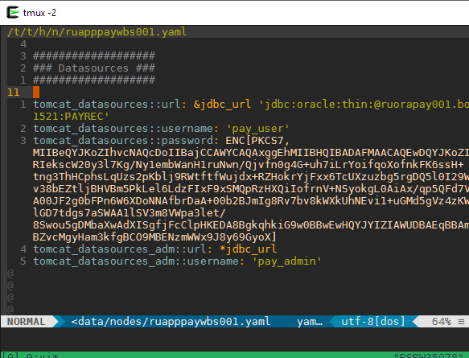

This configuration files includes :

 - auto-pairs (https://github.com/jiangmiao/auto-pairs)
 - fzf (https://github.com/junegunn/fzf.vim)
 - gruvbox (https://github.com/morhetz/gruvbox)
 - vim-airline (https://github.com/vim-airline/vim-airline)
 

